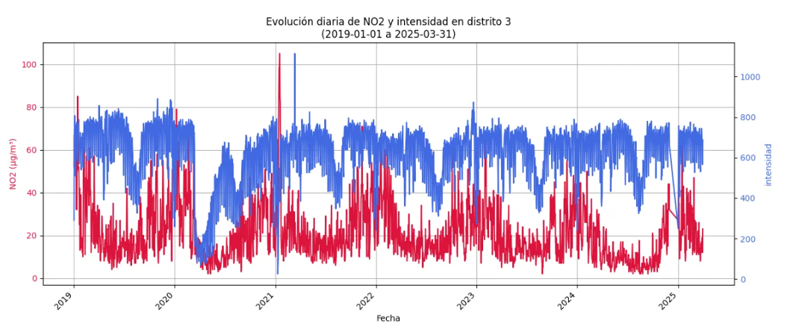
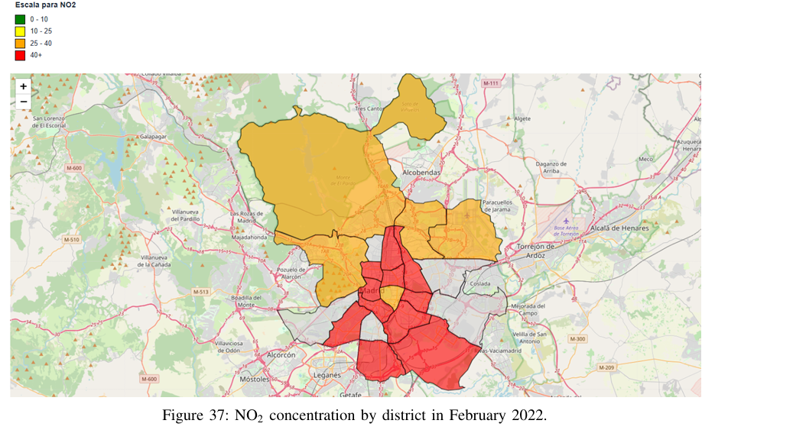

# Smart City Traffic & Pollution Analysis

## I. Introduction  
This project focuses on analyzing traffic and pollution data from Madrid.  
It provides a **Gradio interface with four interactive tabs**, where different insights about traffic and air quality can be explored.  
The objective is to show a scalable workflow: **data ingestion, preprocessing, and visualization**.  
This repository serves as a foundation for data-driven decision-making in smart cities.  


## II. Repository Structure  

```text
├── data
└── src
    ├── ingest
    ├── interface
    ├── Preprocessing
    └── visualization

```

#### 1. data/

Contains input datasets, mainly in CSV or Parquet format. This is where all the raw and processed data is stored for analysis.

**⚠️ Warning:** To replicate the program, please follow the instructions in the `data/README.txt` file.

#### 2. src/ingest/

Scripts for reading CSV files, converting them to Parquet, and uploading data to HDFS. These scripts are executed manually and help organize the raw data into a format suitable for big data processing.

#### 3. src/interface/

Contains the Gradio application. It has four tabs where users can explore different insights about traffic and pollution data interactively.

#### 4. src/Preprocessing/

Scripts to clean, transform, and prepare datasets after initial exploration. These ensure the data is ready for analysis and visualization.

#### 5. src/visualization/

Jupyter notebooks for rapid visualization and exploratory analysis. They help to understand patterns in traffic and pollution data before building final reports or dashboards.

## III. Workflow Overview

The data flow in this project can be understood as follows:

                             ┌────────────────────────────┐
                             │  Open Data Madrid Portal   │
                             │   (Source of all datasets) │
                             └────────────────────────────┘
                                            │
                                        Fetch CSVs         
                                            │
                                            ▼
                             ┌────────────────────────────┐
                             │           ingest           │
                             │        (CSV → Parquet)     │
                             └────────────────────────────┘
                                            │
                                            ▼
                             ┌────────────────────────────┐
                             │       Raw Data Folders     │
                             │----------------------------│
                             │  air_quality/              │
                             │  air_quality_sensors/      │
                             │  traffic_data/             │
                             │  traffic_sensors/          │
                             └────────────────────────────┘
                                           │
                                      Visualization 
                                           │
                                           ▼
                             ┌──────────────────────────────┐
                             │    Preprocessing & Cleaning  │
                             └──────────────────────────────┘
                                           │
                                           ▼
                             ┌────────────────────────────┐
                             │       Processed Data       │
                             │----------------------------│
                             │ air_quality_processed/     │
                             │ traffic_data_processed/    │
                             │ districts/                 │
                             └────────────────────────────┘
                                           │
                              Visualize through Gradio App 
                                           │
                                           ▼
                             ┌────────────────────────────┐
                             │         interface          │
                             │      (Gradio App)          │
                             └────────────────────────────┘


## IV. Technologies Used

- Python 3.9+

- Gradio → Interactive UI

- Apache Spark & Hadoop (HDFS) → Data ingestion and storage

- Pandas / PySpark → Data processing

- Jupyter Notebooks → Visualization and prototyping

# V. Usage > **Pending review:** Detailed usage instructions will be provided soon.

1. Clone the repository
```
git clone <repo_url>
cd <repo_name>
```
2. Install dependencies with uv (necesary)
```
pip install uv
uv sync
```
3. Activate the environment
```
source .venv/bin/activate or .venv/Script/activate
```
4. Configure environment variables

Before running the application, you need to set up the environment variables in the correct order:

- Read the `data/ README` : This will give you guidance on downloading and organizing the Open Data Madrid datasets.

- Prepare raw data: You can use the `src/ingestion` scripts to convert the datasets to Parquet format or add them to HDFS as needed.

- Preprocessing: The raw datasets are intended to be used with Spark and Hadoop. Follow the instructions in `src/preprocessing.py` to process the raw data and generate the cleaned datasets.

- Set environment variables in interface.py: Open `src/interface` and follow its instructions pf `README.md` to properly configure the `.env file.` Ensure that all paths point to the processed datasets generated in the preprocessing step.

Once these steps are complete, proceed to the next step in the workflow.

5. Run the application locally
```
python src/interface/interface.py
```

This will launch a local Gradio interface with four tabs, each displaying different traffic and pollution insights.

# VI. Gradio Results

Below are some example insights you can obtain from the Gradio interface:

- **Gas concentration by district:** Compare pollutant levels (e.g., NO2, PM10, O3) across districts for a given month and year.
- **Traffic intensity and district status:** Visualize traffic intensity and occupancy, and explore how it relates to air quality in specific districts.
- **Traffic & pollution relationships:** Identify correlations between traffic patterns and pollutant concentrations.

<p align="center">
  
</p>

<p align="center">
  
</p>

These visualizations help you quickly identify districts with high traffic and poor air quality, and track temporal changes in pollutant levels.


# License
This project is licensed under the GNU General Public License v3.0 (GPLv3) - see the [LICENSE](LICENSE) file for details.
