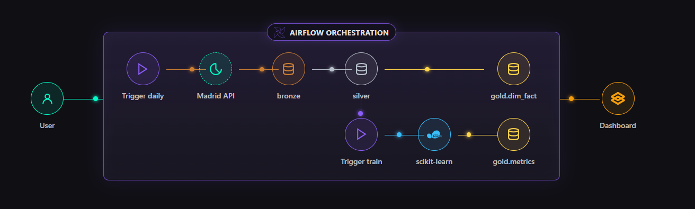
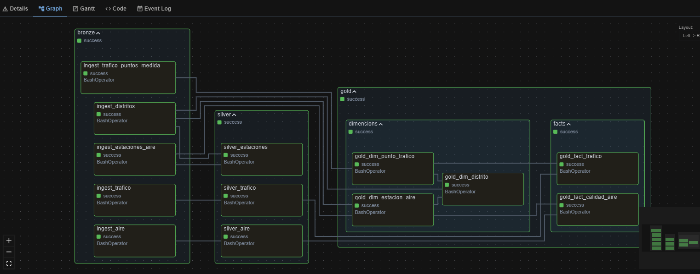
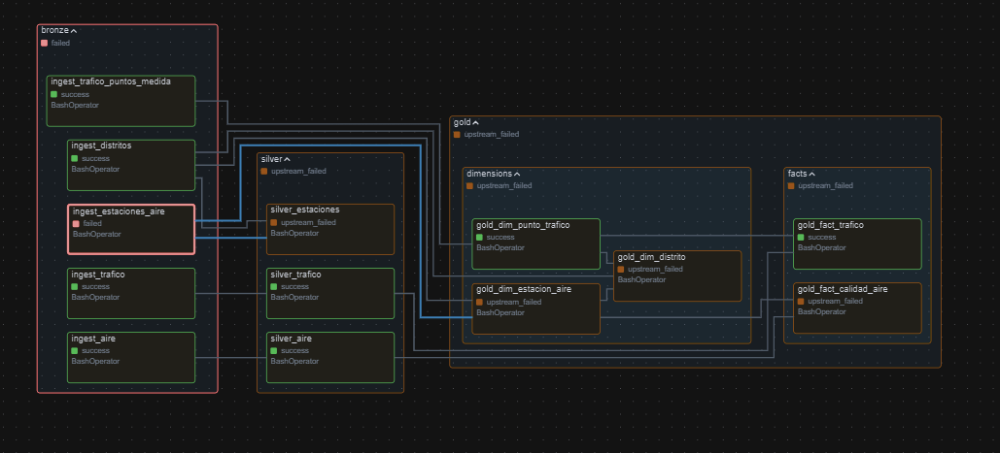
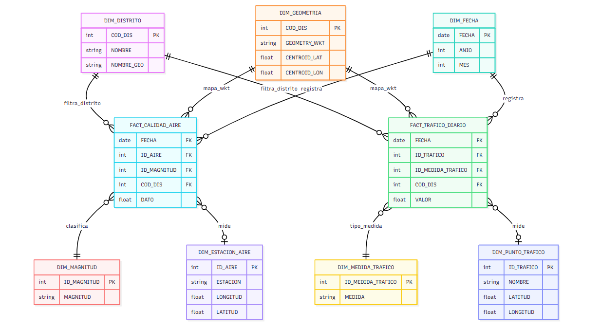

# Madrid Smart Data

Traffic & air quality analytics for Madrid open data: ingest → clean →
forecast → dashboard, orchestrated by Airflow.

<div align="center">

<br/><br/>


</div>

## Workflow



## Where the data comes from

[Madrid Open Data](https://datos.madrid.es) is the city council's public
data portal, free datasets (traffic, air quality, districts...) anyone
can query, no login needed. It's served through **CKAN**, a standard
open-data API: one call (`package_show?id=<dataset>`) returns the
resource list for a dataset, then each resource is just a downloadable
CSV/file. `src/data/bronze/ckan.py` does exactly that call, one dataset
id per source (air, stations, traffic...).

That raw pull lands in **DuckDB + Parquet**, no database server, just
files queried directly with SQL, following the **Medallion**
architecture: `bronze/` (raw, as CKAN gave it), `silver/` (cleaned),
`gold/` (final tables + trained models), each stage only reading the one
before it.

## Run it

```bash
cp .env.template .env
docker compose up --build
```

Two services, two ports:

| Port | Service | What it's for |
|---|---|---|
| **7860** | `dashboard` (Gradio) | See the result: the visualizer, already reading whatever data is in `data/` |
| **8081** | `airflow` (`admin`/`admin`, from `.env`) | Trigger ingestion and retraining |

Trigger sequence in the Airflow UI (`Trigger DAG w/ config`):

1. **`daily_ingest`** first: pulls a year/month from the CKAN API into
   `bronze/`, then runs `src/data/preprocessing_bronze_gold.py` (silver → gold dims/facts).
2. **`retrain_forecast`** after, only once there's data: forecasts the next
   `predict_months` into `gold/ml/`.

## Monitoring

Expected DAG status on success (all tasks green):



If a task fails in `bronze`, it cascades to `silver` and `gold`:



## Dashboard cli

```bash
cp .env.template .env
uv venv
uv sync
uv run python -m src.dashboard.interface
```

## CI/CD

Every merge to `main` triggers:

1. **CI** (automated tests): `ruff check` + `pytest` via GitHub Actions
2. **CD** (automated release): if all tests pass, a new release is created
   automatically with a sequential version number (`release-v1`,
   `release-v2`, `release-v3`, ...). A production server would always read
   the highest release number to know which version is current.

If a merge contains a **breaking change** (a significant change that affects
compatibility), the release version increments accordingly. Otherwise, a
regular release is created with the same version scheme.

---

## What this project enables

- **Automate everything with Airflow**: daily ingestion and model retraining
  run as DAGs, programmable on a real server, no manual execution needed.
- **Interactive visualization of stations and traffic points**: map with all
  24 air quality stations and thousands of traffic measurement points,
  filterable by district.
- **Spot high pollution levels at a glance**: the map colors each district
  by its monthly average (green → red), so you see instantly which districts
  and months exceed safe thresholds.
- **Forecast the next months**: a trained model estimates how each variable
  (NO2, O3...) will evolve in the future, per station.

The gold layer uses a **Galaxy Schema**: air quality and traffic are two
different business processes, but analyzing them together by district and
date needs shared dimensions instead of duplicating them.



### Demo

<video src="https://github.com/user-attachments/assets/7035ff6a-8832-433d-9783-efc64b22313b" controls width="700"></video>

---
