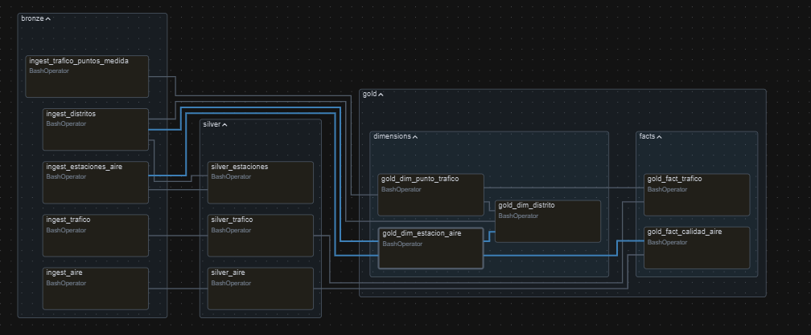

# Madrid Smart Data

Traffic & air quality analytics for Madrid open data: ingest → clean →
forecast → dashboard, orchestrated by Airflow.

<div align="center">

<br/><br/>


</div>

## Workflow


## Where the data comes from

[Madrid Open Data](https://datos.madrid.es) is the city council's public
data portal, free datasets (traffic, air quality, districts...) anyone
can query, no login needed. It's served through **CKAN**, a standard
open-data API: one call (`package_show?id=<dataset>`) returns the
resource list for a dataset, then each resource is just a downloadable
CSV/file. `src/data/bronze/ckan.py` does exactly that call, one dataset
id per source (air, stations, traffic...).

That raw pull lands in **DuckDB + Parquet**, no database server, just
files queried directly with SQL, following the **Medallion**
architecture: `bronze/` (raw, as CKAN gave it), `silver/` (cleaned),
`gold/` (final tables + trained models), each stage only reading the one
before it.

## Run it

```bash
cp .env.template .env
docker compose up --build
```

Two services, two ports:

| Port | Service | What it's for |
|---|---|---|
| **7860** | `dashboard` (Gradio) | See the result: the visualizer, already reading whatever data is in `data/` |
| **8081** | `airflow` (`admin`/`admin`, from `.env`) | Trigger ingestion and retraining |

Trigger sequence in the Airflow UI (`Trigger DAG w/ config`):

1. **`daily_ingest`** first: pulls a year/month from the CKAN API into
   `bronze/`, then runs `src/data/run_pipeline.py` (silver → gold dims/facts).
2. **`train_forecast`** after, only once there's data: retrains the
   forecasting models onto `gold/`.



## Dashboard without Docker (visualizer only)

```bash
cp .env.template .env
uv venv
uv sync
uv run python -m src.dashboard.interface
```

## CI/CD

Not yet, coming soon.

---

More structure and convention detail lives in `CLAUDE.md` (gitignored,
local project memory — not needed to run anything above).
