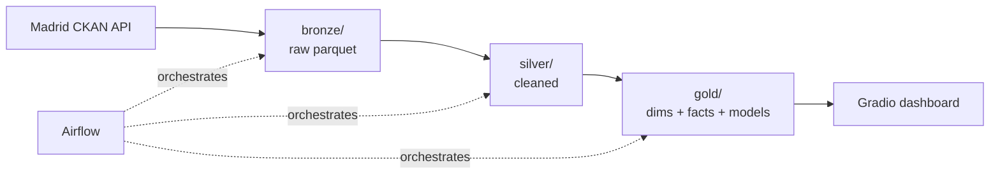

# Madrid Smart Data

Traffic & air quality analytics for Madrid open data — ingest → clean →
forecast → dashboard, orchestrated by Airflow.

<div align="center">

<br/><br/>


</div>

## Workflow


```mermaid
flowchart LR
    CKAN["Madrid CKAN API"] --> B["bronze/\nraw parquet"] --> S["silver/\ncleaned"] --> G["gold/\ndims + facts + models"] --> D["Gradio dashboard"]
    A["Airflow"] -.orchestrates.-> B
    A -.orchestrates.-> S
    A -.orchestrates.-> G
```


## Where the data comes from

[Madrid Open Data](https://datos.madrid.es) is the city council's public
data portal — free datasets (traffic, air quality, districts...) anyone
can query, no login needed. It's served through **CKAN**, a standard
open-data API: one call (`package_show?id=<dataset>`) returns the
resource list for a dataset, then each resource is just a downloadable
CSV/file. `src/data/bronze/ckan.py` does exactly that call, one dataset
id per source (air, stations, traffic...).

That raw pull lands in **DuckDB + Parquet** — no database server, just
files queried directly with SQL — following the **Medallion**
architecture: `bronze/` (raw, as CKAN gave it), `silver/` (cleaned),
`gold/` (final tables + trained models), each stage only reading the one
before it.

## Run it

```bash
cp .env.template .env
docker compose up --build
```

Two services, two ports:

| Puerto | Servicio | Para qué |
|---|---|---|
| **7860** | `dashboard` (Gradio) | Ver el resultado — el visualizador, ya con los datos que haya en `data/` |
| **8081** | `airflow` (`admin`/`admin`, desde `.env`) | Disparar la ingesta y el reentreno |

Secuencia de triggers en la UI de Airflow (`Trigger DAG w/ config`):

1. **`daily_ingest`** primero — pulls a year/month from the CKAN API into
   `bronze/`, then runs `src/data/run_pipeline.py` (silver → gold dims/facts).
2. **`train_forecast`** después, solo una vez haya datos — retrains the
   forecasting models onto `gold/`.

El dashboard (puerto 7860) lee directamente de `data/`, así que basta con
refrescar la página tras cada DAG para ver los datos nuevos — no hace
falta reiniciar el contenedor.

## Dónde vive el dato

Todo el almacenamiento es local: **[DuckDB](https://duckdb.org)** corre
consultas SQL directamente sobre ficheros **`.parquet`** en `data/` — sin
servidor de base de datos, sin instalación aparte. `bronze/` guarda el
crudo tal cual llega de la API, `silver/` la versión limpia, `gold/` las
tablas finales y los modelos entrenados.

## Dashboard sin Docker (solo el visualizador)

```bash
cp .env.template .env
uv run python -m src.dashboard.interface
```

`uv run` instala lo que falte y ejecuta en un solo paso — sin `venv`
manual, sin `activate`. Instala lo mínimo que el visualizador importa de
verdad, nada de `requests`/`scikit-learn`/`xgboost`. Abre en
http://localhost:7860.

Si además quieres correr ingesta o reentreno en local (no en Airflow):
`uv run --extra pipeline python -m src.ml.train`.

## Stack

Python · DuckDB + Parquet (storage local) · Gradio (UI) · scikit-learn /
XGBoost (forecasting) · Airflow + Docker (orquestación).

## CI/CD

Pendiente — próximamente.

---

Más detalle de estructura y convenciones vive en `CLAUDE.md` (gitignored,
memoria local del proyecto — no hace falta para levantar nada de lo de
arriba).
