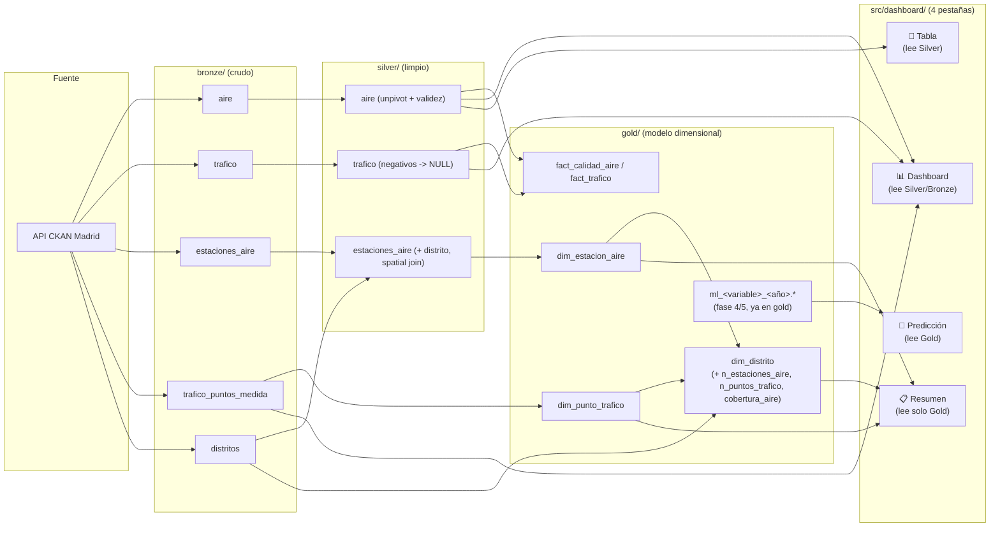

# Smart City Traffic & Pollution Analysis

## I. Introduction

This project analyzes traffic and pollution data from Madrid open data. It provides
a **Gradio dashboard with 4 tabs** (catalog summary, interactive overview, a
filterable readings table, and forecast) to explore air quality and traffic
insights, and it is being rebuilt into a reproducible pipeline: API ingestion →
Parquet + DuckDB → forecasting comparison → gold layer → Airflow.
Full detail lives in `spec/` (mission, tech stack, roadmap, one folder per feature).
Current status and next steps are tracked in `CLAUDE.md`, not here.

## II. Repository structure

```text
MadridSmartData/
├── spec/                       # mission, tech stack, roadmap, one folder per feature
├── data/                       # raw + processed data (not versioned, see data/README.md)
├── src/
│   ├── core/                   # transversal config/logging (added when it has a consumer)
│   ├── data/
│   │   ├── bronze/              # CKAN API client, catalog probe            (phase 1-2)
│   │   ├── silver/              # cleaning, split by domain (aire/trafico/district_join)
│   │   ├── gold/                 # dim_* + fact_* dimensional model, _catalog.yml
│   │   ├── access/              # DuckDB queries                           (phase 3)
│   │   └── run_pipeline.py       # single entry point: silver -> gold
│   ├── ml/                     # forecasting: features, models, evaluation (phase 4)
│   ├── dashboard/               # Gradio UI — entry point, components/ + tabs/, no Spark/HDFS
│   ├── old_ingest/             # legacy manual CSV→Parquet scripts, kept locally only
│   └── old_preprocessing/      # legacy Spark ETL, kept locally only
└── tests/                      # mirrors src/
```

## III. Technologies

- Python 3.11+
- Gradio → interactive UI
- DuckDB → SQL over local Parquet, no server
- geopandas → district shapefile + spatial join
- scikit-learn → forecasting models (phase 4)

No Spark, no HDFS — see `spec/constitution/tech-stack.md` for why they were
dropped.

## IV. Setup

1. Clone the repository
```bash
git clone <repo_url>
cd MadridSmartData
```
2. Install dependencies with [uv](https://docs.astral.sh/uv/)
```bash
pip install uv
uv sync
```
3. Activate the environment
```bash
source .venv/bin/activate  # or .venv/Scripts/activate on Windows
```
4. Run the dashboard (reads local Parquet, see `src/dashboard/README.md`
   for the expected `data/bronze/`, `data/silver/` and `data/gold/` paths)
```bash
python -m src.dashboard.interface
```

## V. Dashboard

Four tabs:

- **📋 Resumen** — catalog only, reads from `data/gold/dim_distrito.parquet`
  (built by `python -m src.data.gold.dimensions`), never from measurement
  data: KPI cards (districts, air stations, traffic points, districts with
  no air coverage), a positions map, a coverage choropleth (green/red per
  district), and a table with coverage badges.
- **📊 Dashboard** — shared filters (Aire/Tráfico, variable, distrito, año/mes),
  KPI cards, district choropleth with individual markers (air stations always
  visible, traffic points only after picking a district — there are ~4,962 of
  them), daily evolution line, and a collapsible aire↔tráfico correlation block.
- **📄 Tabla** — daily readings for one station/gas, cascading dropdowns.
- **🔮 Predicción** — real vs. predicted (held-out validation fold) from the
  fase-4 winning model per variable, no retraining from the UI.

## VI. Architecture


```mermaid
flowchart LR
    subgraph Fuente["Fuente"]
        CKAN["API CKAN Madrid"]
    end

    subgraph Bronze["bronze/ (crudo)"]
        B1["aire"]
        B2["trafico"]
        B3["estaciones_aire"]
        B4["trafico_puntos_medida"]
        B5["distritos"]
    end

    subgraph Silver["silver/ (limpio)"]
        S1["aire (unpivot + validez)"]
        S2["trafico (negativos -> NULL)"]
        S3["estaciones_aire (+ distrito, spatial join)"]
    end

    subgraph Gold["gold/ (modelo dimensional)"]
        G1["dim_distrito\n(+ n_estaciones_aire, n_puntos_trafico, cobertura_aire)"]
        G2["dim_estacion_aire"]
        G3["dim_punto_trafico"]
        G4["ml_&lt;variable&gt;_&lt;año&gt;.*\n(fase 4/5, ya en gold)"]
        G5["fact_calidad_aire / fact_trafico"]
    end

    subgraph Dashboard["src/dashboard/ (4 pestañas)"]
        T1["📋 Resumen\n(lee solo Gold)"]
        T2["📊 Dashboard\n(lee Silver/Bronze)"]
        T3["📄 Tabla\n(lee Silver)"]
        T4["🔮 Predicción\n(lee Gold)"]
    end

    CKAN --> B1 & B2 & B3 & B4 & B5
    B1 --> S1
    B2 --> S2
    B3 --> S3
    B5 --> S3

    B5 --> G1
    S3 --> G2
    B4 --> G3
    G2 --> G1
    G3 --> G1

    S1 --> G5
    S2 --> G5

    G1 --> T1
    G2 --> T1
    G3 --> T1
    G4 --> T4

    S1 --> T2
    S2 --> T2
    B4 --> T2
    S1 --> T3
```


## License

This project is licensed under the GNU General Public License v3.0 (GPLv3) — see
the [LICENSE](LICENSE) file for details.
