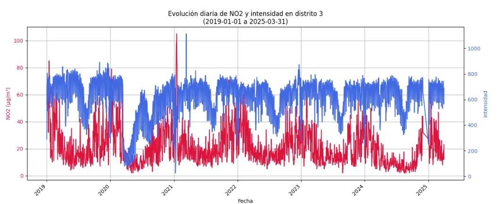
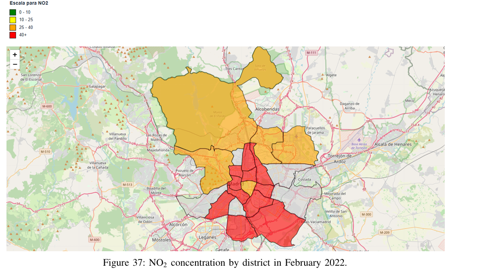

# Smart City Traffic & Pollution Analysis

## I. Introduction

This project analyzes traffic and pollution data from Madrid open data. It provides
a **Gradio interface with four interactive tabs** to explore air quality and traffic
insights, and it is being rebuilt into a reproducible pipeline: API ingestion →
Parquet + DuckDB → forecasting comparison. Full detail lives in `spec/` (mission,
tech stack, roadmap, one folder per feature). Current status and next steps are
tracked in `CLAUDE.md`, not here.

## II. Repository structure

```text
MadridSmartData/
├── spec/                       # mission, tech stack, roadmap, one folder per feature
├── data/                       # raw + processed data (not versioned, see data/README.md)
├── src/
│   ├── core/                   # transversal config/logging (added when it has a consumer)
│   ├── data/
│   │   ├── ingest/             # CKAN API client, catalog probe            (phase 1-2)
│   │   ├── transform/          # cleaning, CSV → Parquet                   (phase 2)
│   │   └── access/             # DuckDB queries                           (phase 3)
│   ├── ml/                     # forecasting: features, models, evaluation (phase 4)
│   ├── app/gradio/             # Gradio UI — entry point, no Spark/HDFS
│   ├── old_ingest/             # legacy manual CSV→Parquet scripts, kept locally only
│   └── old_preprocessing/      # legacy Spark ETL, kept locally only
└── tests/                      # mirrors src/
```

## III. Technologies

- Python 3.11+
- Gradio → interactive UI
- DuckDB → SQL over local Parquet, no server
- geopandas → district shapefile + spatial join
- scikit-learn → forecasting models (phase 4)

No Spark, no HDFS — see `spec/constitution/tech-stack.md` for why they were
dropped.

## IV. Setup

1. Clone the repository
```bash
git clone <repo_url>
cd MadridSmartData
```
2. Install dependencies with [uv](https://docs.astral.sh/uv/)
```bash
pip install uv
uv sync
```
3. Activate the environment
```bash
source .venv/bin/activate  # or .venv/Scripts/activate on Windows
```
4. Run the Gradio app (reads local Parquet, see `src/app/gradio/README.md`
   for the expected `data/bronze/` and `data/processed/` paths)
```bash
python -m src.app.gradio.interface
```

## V. Gradio Results

Example insights available in the current interface:

- **Gas concentration by district:** compare pollutant levels (NO2, PM10, O3...)
  across districts for a given month/year.
- **Traffic intensity and district status:** visualize traffic intensity/occupancy
  and relate it to air quality per district.
- **Traffic & pollution relationships:** correlations between traffic patterns and
  pollutant concentrations.

<p align="center">
  
</p>

<p align="center">
  
</p>

## License

This project is licensed under the GNU General Public License v3.0 (GPLv3) — see
the [LICENSE](LICENSE) file for details.
